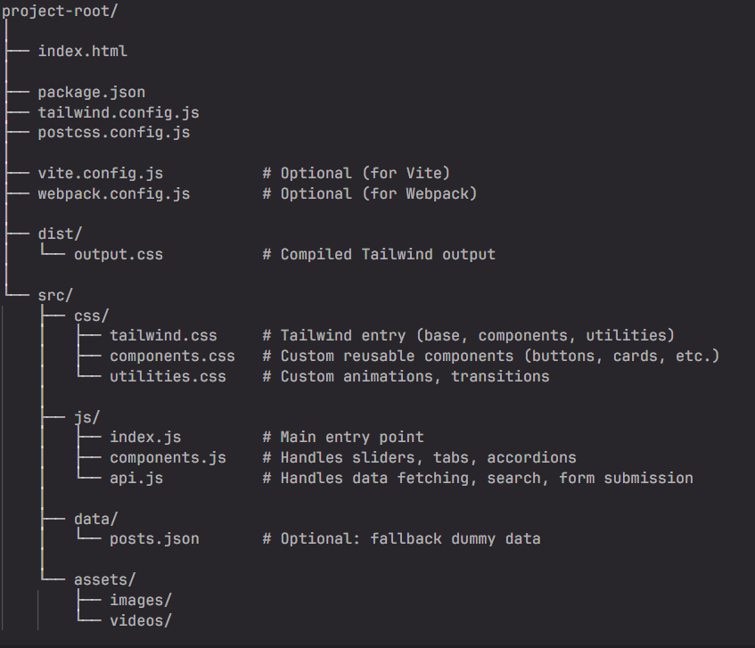

# Responsive and Interactive Travel Website# Responsive and interactive website


## Objective:## Objective:

Implement a responsive, accessible, and visually appealing website from a provided Figma design using Tailwind CSS, while enhancing it with modern UI/UX features such as sliders, accordions, tabs, form validation, dynamic content loading, and search functionality.Implement a responsive, accessible, and visually appealing website from a provided Figma design (choose any one) using Tailwind CSS, while enhancing it with modern UI/UX features such as sliders, accordions, tabs, form validation, dynamic content loading, and search functionality.


### Design Reference:

Figma Link: https://epa.ms/gB0K8### Design Reference:

Figma Link:  https://epa.ms/gB0K8 (choose any one)

## Features Implemented:

✅ **Responsive Design** - Mobile, tablet, and desktop layouts  

✅ **Hero Image Slider** - Auto-playing carousel with navigation  ## Requirements:

✅ **Testimonial Slider** - Smooth testimonial carousel  ### Styling & Layout (Tailwind CSS):

✅ **Destination Slider** - Featured destinations carousel  - Use Tailwind CSS consistently for layout and styling. 

✅ **Tabs** - Filter content by category  - Break UI into reusable components: Header, Footer, Hero, Cards, Buttons, etc. 

✅ **Accordion** - FAQ section with expand/collapse  - Ensure full responsiveness across mobile, tablet, and desktop using Tailwind's responsive utilities. 

✅ **Form Validation** - Real-time validation with error messages  - Match the Figma design precisely: spacing, typography, color palette, etc. 

✅ **Dynamic Content** - Blog posts loaded via API  

✅ **Search Functionality** - Real-time search across blog posts  ### Interactive Features (JavaScript):

✅ **Smooth Animations** - Scroll animations and transitions  - Hero Image Slider: Convert the hero image section into a responsive slider. 

- Section Sliders: Add sliders to other relevant sections like testimonials, destinations, or featured posts. 

## Project Structure- Tabs: Implement tab switching functionality for multi-view sections. 

- Accordion: If not present in the design, add a new accordion-based FAQ or info section inspired by modern designs. 

```

project-trials/### Forms:

├── index.html                  # Main HTML file- Make forms fully functional with proper validation (required fields, email format, etc.). 

├── package.json                # NPM dependencies- Show success/error messages upon submission. 

├── tailwind.config.js          # Tailwind CSS configuration

├── postcss.config.js           # PostCSS configuration### Dynamic Content:

├── vite.config.js              # Vite bundler config (optional)- Fetch blog posts or content dynamically using: 

├── webpack.config.js           # Webpack config (optional)- Dummy APIs (e.g., JSONPlaceholder) or Custom JSON data simulating APIs.

│- Render fetched data into card/list/grid components. 

├── dist/

│   └── output.css              # Compiled Tailwind CSS output### Media Enhancements:

│- Replace static images with videos where applicable to enhance UX. 

├── src/

│   ├── css/### Search Functionality:

│   │   ├── tailwind.css        # Tailwind entry point (@tailwind directives)- Implement a search bar that fetches and filters content from dummy API or JSON data. 

│   │   ├── components.css      # Custom reusable components (buttons, cards, etc.)

│   │   └── utilities.css       # Custom animations, transitions### JavaScript Event Handling:

│   │- Add custom event listeners: 

│   ├── js/- Subscribe form submit → triggers validation and submit handler.

│   │   ├── index.js            # Main entry point - initializes all features- Other buttons (e.g., search or tabs) should handle appropriate events.

│   │   ├── components.js       # Component rendering & content data

│   │   └── api.js              # API module - data fetching, search, forms### Accessibility & Performance (Optional):

│   │- Use semantic HTML5. 

│   └── data/- Ensure keyboard navigation and screen reader compatibility. 

│       └── posts.json          # Fallback dummy data for blog posts- Optimize media and assets for fast load times.

│

└── assets/## Deliverables

    ├── images/                 # Image assets### Project structure (recommended)

    └── videos/                 # Video assets (if any)

```


## File Descriptions### Instructions

1. Keep all your website components within components.js.

### JavaScript Modules2. Avoid creating too many JavaScript files — this helps GIT AI evaluate your code more effectively and provide accurate feedback.

3. If you encounter a "token exceeding" error during GIT AI evaluation, try reducing the number of JavaScript files by combining them into 2 or 3 files

#### `src/js/index.js` - Main Application

- **Navigation**: Mobile menu, smooth scrolling, sticky header

- **Sliders**: Hero, testimonial, and destination sliders

- **Tabs**: Category filtering system
- **Accordion**: FAQ expand/collapse functionality
- **Forms**: Validation and submission handling
- **Search**: Real-time search functionality
- **Scroll Effects**: Intersection Observer animations
- **Utilities**: Debounce, notifications, helper functions

#### `src/js/api.js` - API Module
- **Data Management**: Mock data for blog posts, destinations, testimonials, FAQs
- **Async Methods**:
  - `fetchBlogPosts(category, searchQuery)` - Fetch and filter blog posts
  - `fetchDestinations()` - Fetch destination data
  - `fetchTestimonials()` - Fetch testimonial data
  - `submitContactForm(formData)` - Handle contact form submission
  - `submitNewsletter(email)` - Handle newsletter subscription
  - `submitBooking(formData)` - Handle booking form submission

#### `src/js/components.js` - Component Rendering
- **Content Data**: Static content data structure
- **Render Functions**: 
  - `renderDestinations()` - Render destination cards
  - `renderRecommendedTours()` - Render tour cards
  - `renderFlightOffers()` - Render flight offer cards
  - `renderFeatures()` - Render feature sections
  - `renderVideoGallery()` - Render video gallery
  - `renderFAQ()` - Render FAQ accordion
  - `renderBlog()` - Render blog posts
  - `renderPopularDestinations()` - Render popular destinations

### CSS Structure

#### `src/css/tailwind.css`
```css
@tailwind base;
@tailwind components;
@tailwind utilities;
```

#### `src/css/components.css`
- Custom component styles
- Reusable button, card, and form styles
- Component-specific utilities

#### `src/css/utilities.css`
- Custom animations
- Transitions
- Utility classes

## Installation & Setup

### Prerequisites
- Node.js (v14 or higher)
- npm or yarn

### Install Dependencies
```bash
npm install
```

### Development
```bash
# Start development server
npm run dev

# Build for production
npm run build

# Preview production build
npm run preview
```

### Using Tailwind CLI (Alternative)
```bash
# Watch for changes
npx tailwindcss -i ./src/css/tailwind.css -o ./dist/output.css --watch

# Build for production
npx tailwindcss -i ./src/css/tailwind.css -o ./dist/output.css --minify
```

## Technologies Used

- **HTML5** - Semantic markup
- **Tailwind CSS** - Utility-first CSS framework
- **Vanilla JavaScript** - No frameworks, pure JS
- **PostCSS** - CSS processing
- **Vite/Webpack** - Module bundling (optional)

## Key Features Explained

### 1. Hero Slider
- Auto-plays every 5 seconds
- Manual navigation with prev/next buttons
- Indicator dots for direct navigation
- Keyboard support (arrow keys)
- Pauses on hover

### 2. Form Validation
- Real-time validation on blur
- Email format checking
- Phone number validation
- Minimum length requirements
- Visual error messages

### 3. Search Functionality
- Debounced search (500ms delay)
- Searches across title, excerpt, category, and author
- Real-time results update
- Works with category filters

### 4. Tabs System
- Category-based filtering
- Smooth content transitions
- Works with search functionality
- URL-friendly (can be extended)

### 5. Accordion FAQ
- Single-item expansion
- Smooth height transitions
- Accessible keyboard navigation
- ARIA attributes for screen readers

## Browser Support

- Chrome (latest)
- Firefox (latest)
- Safari (latest)
- Edge (latest)
- Mobile browsers (iOS Safari, Chrome Mobile)

## Performance Optimizations

- Lazy loading images
- Debounced scroll and search events
- Intersection Observer for animations
- Optimized CSS with Tailwind purge
- Minimal JavaScript bundle

## Accessibility Features

- Semantic HTML5 elements
- ARIA labels and roles
- Keyboard navigation support
- Focus management
- Screen reader friendly
- High contrast text
- Responsive font sizes

## Code Organization

### Plain JavaScript (No JSX)
All JavaScript files use vanilla JavaScript for maximum compatibility and ease of understanding:

- **No React/JSX** - Pure JavaScript DOM manipulation
- **No transpilation required** - Works directly in browsers
- **Module pattern** - Clean separation of concerns
- **Event-driven** - Standard event listeners and handlers

### Module Loading
Scripts are loaded in order:
1. `api.js` - Data and API functions
2. `components.js` - Component rendering
3. `index.js` - Main application initialization

## Future Enhancements

- [ ] Add video backgrounds
- [ ] Implement backend API integration
- [ ] Add user authentication
- [ ] Create booking flow
- [ ] Add payment integration
- [ ] Implement multi-language support
- [ ] Add dark mode
- [ ] Progressive Web App (PWA)

## License

MIT License - feel free to use this project for learning and development.

## Author

Developed as part of EPAM training program.

---

**Note**: This is a demonstration project. In production, replace mock API calls with real backend endpoints and implement proper security measures for form submissions.
